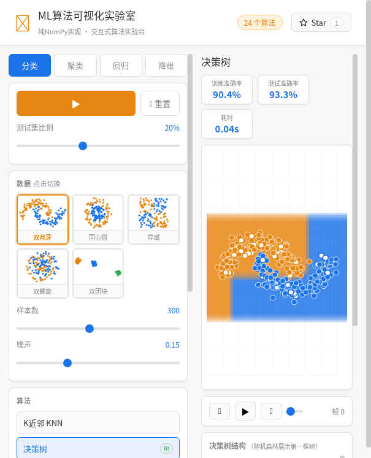
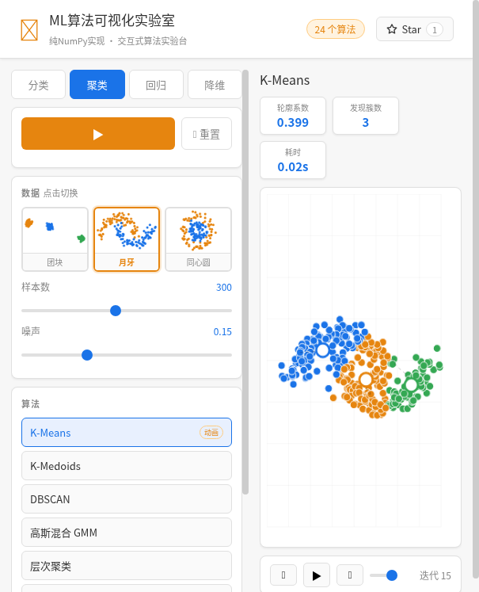
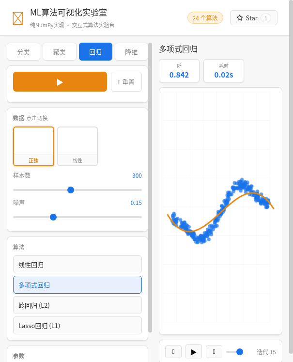
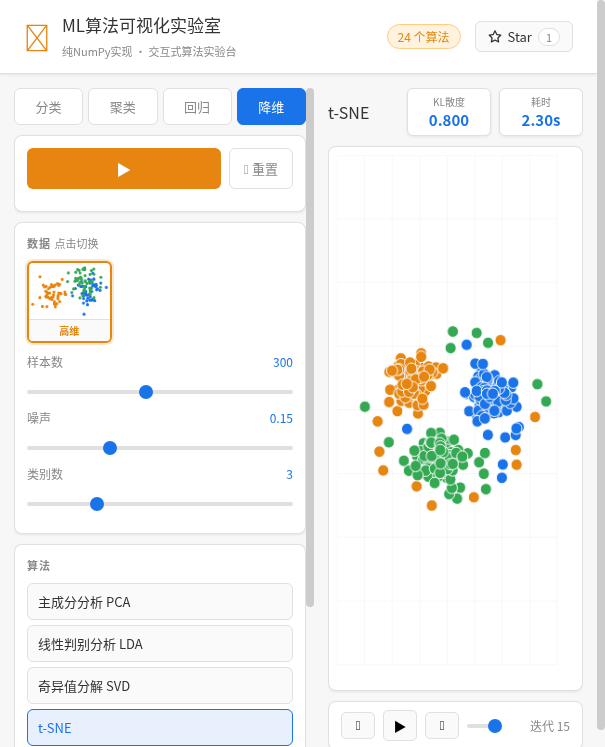

<div align="center">

# DataMiningAlgorithm

**纯 NumPy 手写的 30+ 数据挖掘 / 机器学习算法实现，附带一个交互式可视化实验室**

[](https://github.com/zanezhao0708/DataMiningAlgorithm/stargazers)
[](LICENSE)
[](https://www.python.org/)
[](https://numpy.org/)
[](#算法清单)
[](https://github.com/zanezhao0708/DataMiningAlgorithm/pulls)

不依赖 scikit-learn / PyTorch，每一个算法都从零实现、逐行中文注释，
既能当**算法学习笔记**，也能打开浏览器**动手玩**。

[在线体验](#在线体验不下载代码) · [快速开始](#快速开始) · [算法清单](#算法清单) · [可视化实验室](#可视化实验室) · [代码示例](#代码示例)

</div>

---

## 在线体验（不下载代码）

**官方演示：[https://datamining-2mqf.onrender.com](https://datamining-2mqf.onrender.com)**（点开即玩，无需安装任何东西）

也想部署一份自己的？

[](https://render.com/deploy/repo/zanezhao0708/DataMiningAlgorithm)

1. 点上面按钮，用 GitHub 账号登录 Render（免费，无需信用卡）
2. 仓库已内置 [render.yaml](render.yaml)，配置自动填好，直接点 **Apply / Create**
3. 等 2-3 分钟构建完成，得到你的专属链接 `https://ml-algo-lab.onrender.com`，发给任何人都能直接打开玩

## 亮点

- **纯 NumPy 实现** —— 无高层框架黑盒，公式到代码一一对应，适合啃原理
- **交互式可视化实验室** —— 24 个算法"左边调参、右边看效果"，决策边界 / 聚类动画 / 拟合曲线 / 降维投影实时渲染
- **训练动画回放** —— MLP 逐 epoch 决策边界演化 + 损失曲线，K-Means 质心移动轨迹
- **模型可解释** —— 决策树 / 随机森林自动渲染树结构 SVG
- **中文逐行注释** —— 每个文件都是独立可读的算法教程，`python xxx.py` 即可运行自带示例

## 可视化实验室

```bash
pip install -r requirements.txt
cd visualization_lab && python main.py
# 浏览器打开 http://localhost:8000
```

| 分类 · 决策边界 + 树结构 | 聚类 · K-Means 迭代动画 |
|:---:|:---:|
|  |  |
| **回归 · 拟合曲线 + R²** | **降维 · t-SNE 投影** |
|  |  |

**玩法：**

- 5 种内置数据集（双月牙 / 同心圆 / 异或 / 双螺旋 / 团块）缩略图一键切换，样本数、噪声滑块实时调节
- 训练 / 测试集划分，空心点标记测试样本，准确率 / 轮廓系数 / R² / KL 散度等指标实时显示
- 所有参数滑块改动即自动重跑；MLP、K-Means 支持 ▶ 播放训练动画

更多接口说明见 [visualization_lab/README.md](visualization_lab/README.md)。

## 快速开始

```bash
# 1. 克隆
git clone https://github.com/zanezhao0708/DataMiningAlgorithm.git
cd DataMiningAlgorithm

# 2. 安装依赖（仅需 numpy / pandas；可视化实验室另需 fastapi / uvicorn）
pip install -r requirements.txt

# 3. 任选其一
cd visualization_lab && python main.py   # 打开可视化实验室 → http://localhost:8000
python src/traditional_ml/knn.py         # 或直接运行任意算法的自带示例
```

## 算法清单

### 分类（10）

| 算法 | 源码 | 一句话说明 |
|---|---|---|
| K近邻 KNN | [knn.py](src/traditional_ml/knn.py) | 距离投票，向量化距离矩阵加速 |
| 决策树 | [decision_tree.py](src/traditional_ml/decision_tree.py) | 基尼系数分裂，可导出树结构 |
| 逻辑回归 | [logistic_regression.py](src/traditional_ml/logistic_regression.py) | Sigmoid + 梯度下降，输出概率 |
| 支持向量机 SVM | [svm.py](src/traditional_ml/svm.py) | 铰链损失 + L2 正则的次梯度优化 |
| 朴素贝叶斯 | [naive_bayes.py](src/traditional_ml/naive_bayes.py) | 高斯分布建模的条件独立分类器 |
| 感知机 | [perceptron.py](src/traditional_ml/perceptron.py) | 最原始的在线线性分类器 |
| AdaBoost | [adaboost.py](src/traditional_ml/adaboost.py) | 决策树桩加权集成 |
| 随机森林 | [random_forest.py](src/traditional_ml/random_forest.py) | Bootstrap + 特征随机采样投票 |
| Softmax 回归 | [softmax_regression.py](src/traditional_ml/softmax_regression.py) | 多分类逻辑回归 |
| 多层感知机 MLP | [mlp.py](src/traditional_ml/mlp.py) | 反向传播全连接网络，支持动画回放 |

### 聚类（6）

| 算法 | 源码 | 一句话说明 |
|---|---|---|
| K-Means | [kmeans.py](src/traditional_ml/kmeans.py) | 经典质心迭代，带收敛历史 |
| K-Medoids | [kmedoids.py](src/traditional_ml/kmedoids.py) | 真实样本作中心，对离群点鲁棒 |
| DBSCAN | [dbscan.py](src/traditional_ml/dbscan.py) | 密度连通，自动识别噪声与任意形状簇 |
| 高斯混合 GMM | [gmm.py](src/traditional_ml/gmm.py) | EM 算法软聚类 |
| 层次聚类 | [hierarchical_clustering.py](src/traditional_ml/hierarchical_clustering.py) | single / complete / average 链接 |
| 谱聚类 | [spectral_clustering.py](src/traditional_ml/spectral_clustering.py) | 拉普拉斯特征映射 + RBF 亲和 |

### 回归（4）

| 算法 | 源码 | 一句话说明 |
|---|---|---|
| 线性回归 | [linear_regression.py](src/traditional_ml/linear_regression.py) | 梯度下降 / 正规方程双解法 |
| 多项式回归 | [polynomial_regression.py](src/traditional_ml/polynomial_regression.py) | 多项式特征扩展拟合非线性 |
| 岭回归 (L2) | [ridge_regression.py](src/traditional_ml/ridge_regression.py) | L2 正则防过拟合 |
| Lasso 回归 (L1) | [lasso_regression.py](src/traditional_ml/lasso_regression.py) | L1 正则稀疏化 + 特征选择 |

### 降维（4）

| 算法 | 源码 | 一句话说明 |
|---|---|---|
| PCA | [pca.py](src/traditional_ml/pca.py) | 最大方差方向投影，输出方差贡献率 |
| LDA | [lda.py](src/traditional_ml/lda.py) | 有监督，最大化类间/类内散度比 |
| SVD | [svd.py](src/traditional_ml/svd.py) | 奇异值分解，支持重构 |
| t-SNE | [tsne.py](src/traditional_ml/tsne.py) | 困惑度二分搜索 + 动量梯度下降 |

### 关联规则 / 图 / 序列 / 推荐（6，库内直接调用）

| 算法 | 源码 | 一句话说明 |
|---|---|---|
| Apriori | [apriori.py](src/traditional_ml/apriori.py) | 频繁项集 + 支持度/置信度规则 |
| FP-Growth | [fpgrowth.py](src/traditional_ml/fpgrowth.py) | FP 树压缩，免候选项集 |
| 隐马尔可夫 HMM | [hmm.py](src/traditional_ml/hmm.py) | Baum-Welch 训练 + Viterbi 解码 |
| PageRank | [pagerank.py](src/traditional_ml/pagerank.py) | 链接分析节点重要性排序 |
| 梯度提升 GBDT | [gradient_boosting.py](src/traditional_ml/gradient_boosting.py) | 回归树迭代拟合残差 |
| 协同过滤 | [collaborative_filtering.py](src/traditional_ml/collaborative_filtering.py) | user/item 双模式推荐 |

### 神经网络（2）

| 模块 | 源码 | 说明 |
|---|---|---|
| 基础三层网络 | [basic_nn.py](src/neural_networks/basic_nn.py) | 784-30-50-3，Sigmoid + Softmax，SGD |
| MNIST 分类器 | [mnist_classifier.py](src/neural_networks/mnist_classifier.py) | 四层 ReLU 网络，完整反向传播 |

## 代码示例

所有算法遵循统一的 `fit / predict / score` 接口：

```python
from src.traditional_ml import KNN, DecisionTree, KMeans, PCA, TSNE

# 分类
model = KNN(k=5)
model.fit(X_train, y_train)
print(f"准确率: {model.score(X_test, y_test):.4f}")

# 聚类
km = KMeans(n_clusters=3)
km.fit(X)
labels = km.labels

# 降维
emb = TSNE(perplexity=20, n_iter=500).fit_transform(X)
```

每个 `.py` 文件底部都带 `__main__` 自测示例，直接 `python src/traditional_ml/xxx.py` 即可看到运行结果。

## 项目结构

```
.
├── visualization_lab/          # 交互式可视化实验室（FastAPI Web 应用）
│   ├── main.py                 # 后端入口：python main.py → http://localhost:8000
│   ├── services/               # 数据集生成 + 算法注册表/统一运行器
│   └── static/                 # 前端：Canvas 决策边界 / 树结构 SVG / 训练动画
├── src/
│   ├── traditional_ml/         # 30 个传统 ML 算法（纯 NumPy，中文注释）
│   ├── neural_networks/        # 手写神经网络（含 MNIST 分类器）
│   └── utils/                  # 数据加载工具（PKL ↔ CSV）
├── docs/screenshots/           # README 截图
├── requirements.txt
└── LICENSE                     # MIT
```

## 更新日志

- **2026-08-14 (三)**：可视化实验室大升级 —— MLP 逐 epoch 训练动画 + 损失曲线、训练/测试集划分、数据集缩略图、TF Playground 风格 UI；KNN 预测向量化提速 33 倍；网页顶栏新增 GitHub Star 按钮
- **2026-08-14 (二)**：新增 t-SNE 与可视化实验室；修复 GMM 协方差更新、多项式回归数值发散、SVD 方差贡献率等 bug
- **2026-08-14**：新增 10 个算法（K-Medoids、HMM、PageRank、SVD、FP-Growth、GBDT、LDA、Softmax、协同过滤、谱聚类）
- **2024-08-13**：重构项目结构，补齐 MNIST 分类器完整训练代码
- **初始版本**：基础三层神经网络

## 贡献

欢迎 Issue / PR！无论是补算法（如 XGBoost、UMAP）、修 bug 还是改进可视化，都感谢你的贡献。

1. Fork 本仓库
2. 创建特性分支 `git checkout -b feature/amazing`
3. 提交改动 `git commit -m 'feat: add amazing feature'`
4. 推送并发起 Pull Request

## 许可证

基于 [MIT](LICENSE) 许可证开源，仅供学习与研究使用。

---

<div align="center">

如果这个项目帮你理解了某个算法，欢迎点个 Star 支持一下！

</div>
